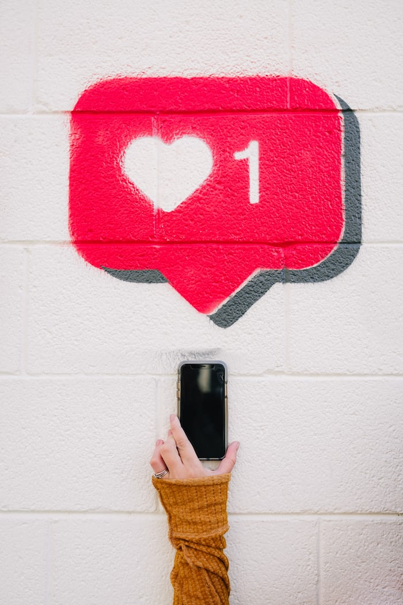
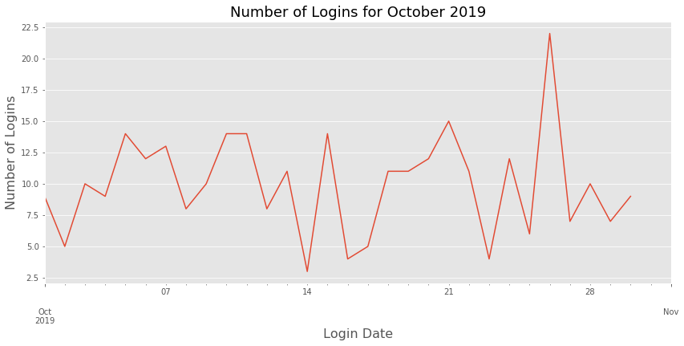
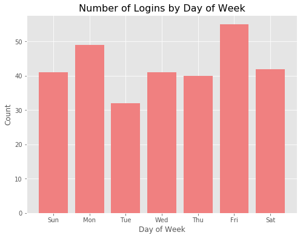
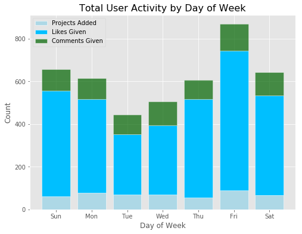
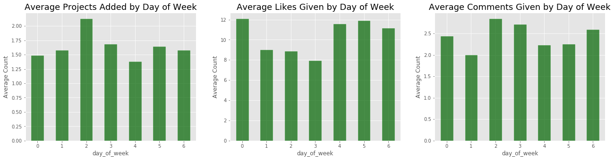
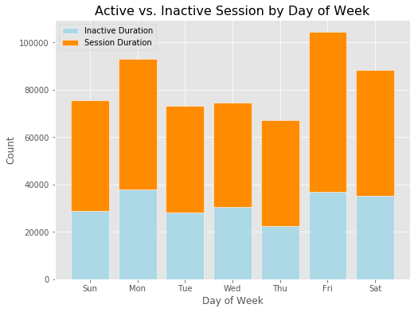
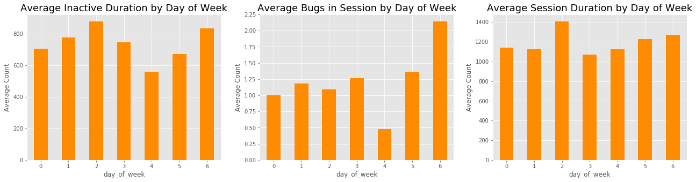
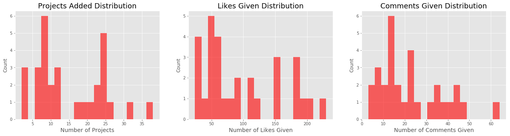
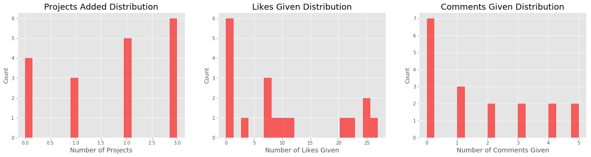
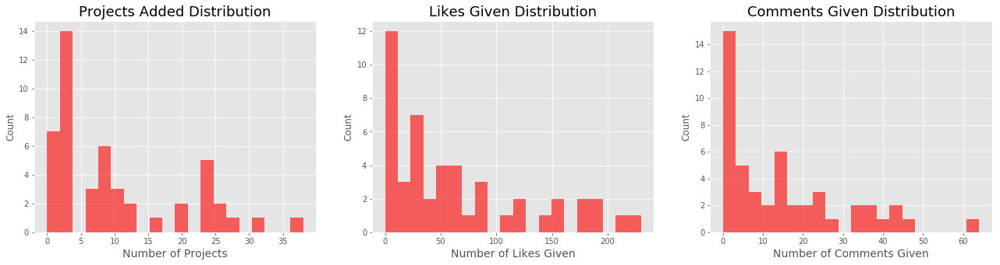

# User Engagement Analysis

## Table of Contents
- [Background](#Background)
- [Project Goal](#project-goal)
- [Data](#the-data)
- [Exploratory Data Analysis](#exploratory-data-analysis)
- [Conclusion and Future Analysis](#conclusion-and-future-analysis)

---

## Background 

One of the funnest tasks as a Data Analyst is to dive deep into the data and extract a story, or any information we can learn from. When working with data related to a product, user engagement is one of the key metrics that tells us whether users find value in a product or service. I was given user login data for the month of October in 2019. Let's buckle up and go right into some data digging!

---

## Project Goal

 My goal is to understand user activities during their duration on the site, discover weekly or daily trends, what features drive the most traffic from our users, what features attract users to come back, how many repeated users, etc. Ultimately, I would like our analysis to generate actionable items that can help us drive user engagement. 

---

## The Data

I was given a dataset with with user activity information for the month of October 2019. User engagement metrics include projects added, likes given, comments given, inactive duration, bugs in session, and session duration. There was one null value in the "session likes given" column and I replaced it with 0. I also did some feature engineering and created an extra column to extract day of week from the login date column.

---

## Exploratory Data Analysis

### An overview of data

There were a total of 300 sessions that occurred in the month of October 2019, with **48 unique users, and 30 repeated users**. Out of 300 total sessions, 142 sessions had durations longer than average, and 158 sessions had durations shorter than the average duration. 
As seen below, there was a huge spike in user login on October 26th, which was a Saturday. I would be curious to explore the possible reasons for the spike, there could have been a new feature roll out, a promotion, a mention from a YouTuber, etc. The biggest dip of the month occurred on October 14th, which was the Columbus Day. It could be explained that people were out celebrating the long weekend and gave their brain a little rest. 

### What day of the week generated the most traffic?

As you can see, users were most likely to log in on a Friday and least likely to log in on a Tuesday.

    

### How did user activity vary between day of week?

Likes given by users constituted the majority of user activity, which makes sense as they consume the least effort and least time to do. As you can see, the amount of each user activity stay pretty consistently throughout the week. Comments given to projects by users are slightly higher in general on Fridays.  

One interesting thing to point out here is, although Fridays generate the highest amount of traffic, **users tend to engage in longer activities on Tuesdays**. Below graph shows average user engagement by activity, and it shows that on average, users added more projects and left more comments on Tuesdays than any day of the week. Some of the reasonings I can think of are: 

- They were seeking inspiration to help with weekly or work/school projects
- Users tend to be more productive on Tuesdays
- Users had more time to conduct longer activities on Tuesdays

### Next, I want to look at session duration data. Let's look at active vs. inactive session by day of week.

Inactive duration and active duration spread out pretty evenly throughout the week. However, inactive durations consumed half, if not more, of the total session duration. This is telling me that users might be leaving the site running in the background, or they stayed sign in and did not close the tab after they were done with the site. 

The graph below shows average inactive and active duration during the week. As users engaged in longer activities on Tuesdays, the average session duration and inactive duration also lengthened on Tuesdays. Another interesting thing to note here is average bugs in session - there tend to be more bugs that occurred on Saturdays, and least bugs occurred on Thursdays. 

### Earlier we learned that there were 48 unique users who logged in. I wanted to know what repeated users mostly spent their time doing on the site, and how they compared to users with single logins.

Clearly repeated users engaged in more activities than single login users. More than 50% of each user activity were engaged by single login users. Not only that, all users in the month of October 2019 engaged in some sort of activities. This makes me believe that we can drive user sign up and user engagement from expanding our user base. 

#### Distribution graphs for repeated users 

#### Distribution graphs for users with single logins

#### Distribution graphs for all users

---

## Conclusion and Future Analysis

### Key Takeaways:

- 62.5% of those who logged in during the month of October 2019 were repeated users.   
- 47.3% of sessions were above average duration; 52.7% of sessions were below average duration.  
- Fridays: most logins. Tuesday: most engaged in long activities.    

Because all users engaged in one or more activities after they logged in, it makes me believe that users are finding value in the product, and if we increase our user base, we can drive user sign-ups and user engagement even higher! Here are some of the suggestions to increase user sign-ups and engagement:  

- Expand user base by having YouTuber shout outs  
- Use machine learning to feature projects that are of most interest to users  
- Have users select 3-5 topics that are most interesting to the users, and projects with those   topics or hashtags would be featured to those particular users  
- Consider implementing challenges, or have featured theme monthly or periodically  
- Users tend to more productive on Tuesdays - find ways to encourage more logins  
- Encourage users to also like zero-liked projects. People who receive comments and likes on their projects will tend to like others too!

## Future Analysis

- Explore what caused the spike of logins on October 26th.  
- Find out how inactive sessions were capture - are they sessions left idle for more than a certain amount of time? What if users closed the window without signing out - would that add to inactive session time?  
- Login time - finding out which hours users are most active can help with future rollouts, or A/B testing or site maintenance.  
- Most active users - find out what the most active users are doing on site.  
- Analyze most liked and commented projects and articles, discover what makes them unique and popular. Inspire users to add those components to their own projects!

 

